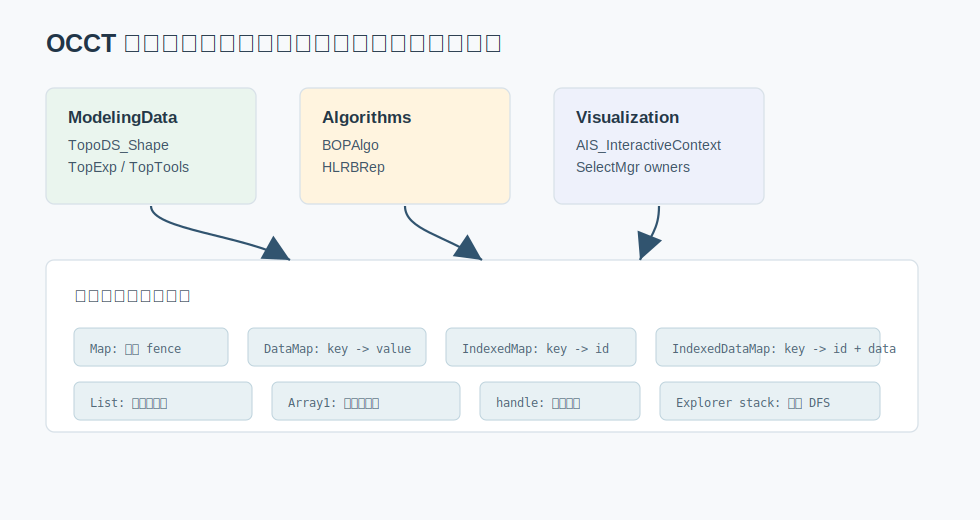

# 01. 从普通数据结构到 OCCT 源码地图

OCCT 是一个 CAD/CAE 几何内核。它的代码里到处都是熟悉的数据结构，但使用方式和普通课程里的例子不一样：数据结构不再是单独的练习题，而是夹在拓扑、几何、选择、布尔运算、显示和数据交换流程中。



最值得先建立的视角是：

```text
几何/拓扑对象
  -> 需要稳定身份
  -> 需要快速查找和去重
  -> 需要从对象反查编号、祖先、结果、来源
  -> 需要在大型算法里反复遍历和更新
```

这就是为什么 OCCT 里哈希表、索引表、链表和数组出现得特别密。

## OCCT 为什么有 NCollection

在 `src/FoundationClasses/TKernel/NCollection` 下面，OCCT 提供了一套自己的容器：

- `NCollection_Map<Key, Hasher>`：集合，负责去重和 membership test。
- `NCollection_DataMap<Key, Value, Hasher>`：哈希表，类似 `unordered_map`。
- `NCollection_IndexedMap<Key, Hasher>`：集合 + 稳定整数编号。
- `NCollection_IndexedDataMap<Key, Value, Hasher>`：key-value 映射 + 稳定整数编号。
- `NCollection_List<T>`：链表。
- `NCollection_Sequence<T>`：双向序列，偏 OCCT 传统 API 风格。
- `NCollection_Array1<T>`：带上下界的一维数组，常见下标不是从 0 开始。
- `NCollection_DynamicArray<T>`：动态数组；旧名 `NCollection_Vector<T>` 在 OCCT 8.0 中已 deprecated。

这些容器有几个共同目标：

- 和 OCCT 的 allocator、异常、RTTI、句柄体系兼容。
- 保持旧 API 的迭代器习惯，例如 `More()`、`Next()`、`Value()`。
- 支持 `TopAbs`、`TopoDS`、几何算法里大量稳定编号和反向索引需求。
- 在历史代码中保持二进制和源码迁移的连续性。

## 三条贯穿全库的主线

### 主线一：拓扑对象需要身份管理

CAD 模型里同一条 edge 可能被两个 face 共享，同一个 vertex 可能被多条 edge 引用。如果算法每次遇到对象都复制一份，就很难回答“它是不是同一条边”。所以 OCCT 大量使用：

```cpp
NCollection_Map<TopoDS_Shape, TopTools_ShapeMapHasher>
NCollection_IndexedMap<TopoDS_Shape, TopTools_ShapeMapHasher>
```

`Map` 负责“见过没有”，`IndexedMap` 进一步给 shape 一个稳定编号。

### 主线二：算法状态需要反查

布尔运算、修复、网格、选择都需要从一个对象反查另一组对象。例如：

```text
edge -> adjacent faces
original face -> generated result faces
result edge -> origin edges
interactive object -> display status
```

这些关系通常写成：

```cpp
NCollection_DataMap<Key, Value, Hasher>
NCollection_IndexedDataMap<Key, Value, Hasher>
```

当 value 是 `NCollection_List<T>` 时，它就是“一对多关系表”。

### 主线三：高频计算要从对象世界进入整数世界

几何对象很复杂，但循环计算喜欢整数编号和数组。OCCT 常见做法是：

```text
TopoDS_Shape -> index -> Array1[index]
```

这和图算法里“城市名 -> 顶点编号 -> dist 数组”是同一个思想。`HLRBRep_Data` 就是很好的例子。

## 8.0 的一个重要变化

过去很多示例会写：

```cpp
TopTools_IndexedMapOfShape aMap;
TopExp::MapShapes(aShape, TopAbs_FACE, aMap);
```

在 OCCT 8.0 中，很多 `TopTools_*` 容器别名已经被放入 `src/Deprecated/NCollectionAliases`。例如 `TopTools_IndexedMapOfShape.hxx` 里说明应直接使用：

```cpp
NCollection_IndexedMap<TopoDS_Shape, TopTools_ShapeMapHasher>
```

同理：

```cpp
NCollection_Map<TopoDS_Shape, TopTools_ShapeMapHasher>
NCollection_List<TopoDS_Shape>
NCollection_IndexedDataMap<
    TopoDS_Shape,
    NCollection_List<TopoDS_Shape>,
    TopTools_ShapeMapHasher>
```

教程后文会直接使用新版类型，同时在必要处提醒旧名。

## 从课程数据结构迁移过来

如果你已经学过动态数组、链表、哈希表、树和图，可以这样对照：

| 普通课程概念 | OCCT 里的真实用法 |
| --- | --- |
| 动态数组 | `NCollection_Array1<HLRBRep_EdgeData>` 保存按编号访问的边数据 |
| 链表 | `NCollection_List<TopoDS_Shape>` 保存一个 shape 的多个 image/origin |
| 哈希表 | `NCollection_DataMap<TopoDS_Shape, ...>` 从 shape 查业务数据 |
| 集合 | `NCollection_Map<TopoDS_Shape, ...>` 做 fence，避免重复加入 |
| 索引表 | `NCollection_IndexedMap<TopoDS_Shape, ...>` 给 face/edge/vertex 编号 |
| 邻接表 | `IndexedDataMap<Shape, List<Shape>>` 表示 shape 到 ancestor 列表 |
| 栈 | `TopExp_Explorer` 内部用迭代器栈做深度遍历 |
| 引用计数 | `opencascade::handle<T>` 管理对象图生命周期 |

OCCT 的难点不是数据结构本身，而是“同一个 shape 在不同语义下是否算同一个”。这会在第 3 章展开。

## 本章阅读建议

打开 OCCT 源码时，优先从这些文件入手：

```text
src/FoundationClasses/TKernel/NCollection/NCollection_Map.hxx
src/FoundationClasses/TKernel/NCollection/NCollection_DataMap.hxx
src/FoundationClasses/TKernel/NCollection/NCollection_IndexedMap.hxx
src/FoundationClasses/TKernel/NCollection/NCollection_DynamicArray.hxx
src/ModelingData/TKBRep/TopoDS/TopoDS_Shape.hxx
src/ModelingData/TKBRep/TopExp/TopExp.cxx
```

不要一开始就读 `BOPAlgo` 的全部细节。先抓住容器模式，后面再看大型算法时会轻松很多。
