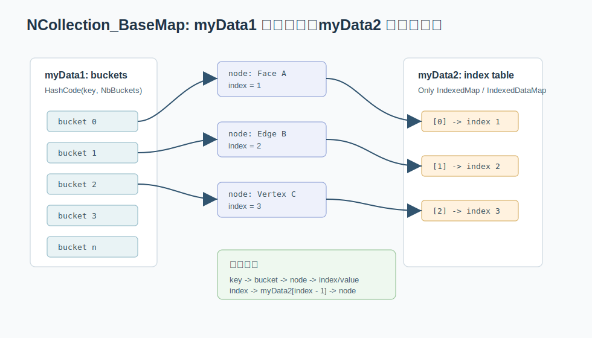

# 02. NCollection 哈希表：桶、节点、索引数组

OCCT 的 `NCollection_Map`、`NCollection_DataMap`、`NCollection_IndexedMap`、`NCollection_IndexedDataMap` 都建立在 `NCollection_BaseMap` 之上。它们不是简单包一层 STL，而是自己维护桶数组、节点链和可选的索引数组。



关键文件：

```text
src/FoundationClasses/TKernel/NCollection/NCollection_BaseMap.hxx
src/FoundationClasses/TKernel/NCollection/NCollection_BaseMap.cxx
src/FoundationClasses/TKernel/NCollection/NCollection_Map.hxx
src/FoundationClasses/TKernel/NCollection/NCollection_DataMap.hxx
src/FoundationClasses/TKernel/NCollection/NCollection_IndexedMap.hxx
src/FoundationClasses/TKernel/NCollection/NCollection_IndexedDataMap.hxx
```

## BaseMap 的两块数据

`NCollection_BaseMap` 里有两个核心指针：

```cpp
NCollection_ListNode** myData1;
NCollection_ListNode** myData2;
size_t                 myNbBuckets;
size_t                 mySize;
```

可以这样理解：

- `myData1`：哈希桶数组。每个桶指向一条节点链。
- `myData2`：可选的索引数组。只有 indexed 容器需要，用于 `index -> node`。
- `myNbBuckets`：桶数量。
- `mySize`：元素数量。

普通 `Map` 和 `DataMap` 只需要从 key 找节点，所以 `myData1` 就够了。`IndexedMap` 和 `IndexedDataMap` 还要支持 `FindKey(index)`、`FindFromIndex(index)` 这类按编号访问，因此还要维护 `myData2`。

## 一个插入操作发生了什么

以 `NCollection_IndexedMap<TopoDS_Shape, TopTools_ShapeMapHasher>` 为例，插入一条 edge 时可以拆成几步：

```text
1. 用 ShapeMapHasher 计算 hash。
2. hash 对 bucket 数取模，落到 myData1 的某个桶。
3. 沿桶链逐个比较 IsSame，确认是否已经存在。
4. 如果不存在，创建新节点，节点里保存 key 和 index。
5. 把节点接到桶链上。
6. 把 myData2[index - 1] 指向这个节点。
```

所以它不是“两个表保存两份数据”，而是：

```text
myData1 和 myData2 都指向同一批节点。
```

这让 key 查找和 index 查找都能回到同一个节点，不需要维护两份 shape。

## 为什么 index 从 1 开始

很多 OCCT API 使用 1-based index，例如：

```cpp
for (int i = 1; i <= aMap.Extent(); ++i)
{
  const TopoDS_Shape& aS = aMap.FindKey(i);
}
```

原因主要是历史和 API 习惯。`myData2` 内部仍然是 C++ 数组，所以源码里会出现 `index - 1`。读 `IndexedMap` 时，心里要同时有两个坐标系：

```text
对外：1..Extent()
内部：0..Extent()-1
```

## Map：集合

`NCollection_Map<Key, Hasher>` 只保存 key。典型操作：

- `Add(key)`：如果不存在就加入，返回是否真的插入。
- `Contains(key)`：判断是否存在。
- `Remove(key)`：删除。
- `Iterator`：遍历所有 key。

它适合做 fence，也就是“我已经处理过这个对象了吗？”。

在 `BOPAlgo_Builder_1.cxx` 里可以看到类似模式：

```cpp
NCollection_Map<TopoDS_Shape, TopTools_ShapeMapHasher> aMFence;
```

`aMFence` 的语义不是业务数据表，而是去重门禁。布尔算法遍历大量候选 shape 时，重复 shape 很常见，集合能避免同一对象被加入多次。

## DataMap：字典

`NCollection_DataMap<Key, Value, Hasher>` 类似 `unordered_map`。典型操作：

- `Bind(key, value)`：绑定新 key。
- `Bound(key, value)`：如果 key 不存在就绑定，并返回 value 指针/引用。
- `Find(key)`：取值，不存在通常抛异常。
- `Seek(key)`：返回指针，不存在返回空指针。
- `ChangeSeek(key)`：返回可修改指针。
- `IsBound(key)`：判断 key 是否存在。

大型算法里更常见 `Seek` 和 `ChangeSeek`，因为它们能表达“如果存在就追加，不存在就创建”的路径。

例如 `BOPAlgo_Builder` 的成员：

```cpp
NCollection_DataMap<TopoDS_Shape,
                    NCollection_List<TopoDS_Shape>,
                    TopTools_ShapeMapHasher> myImages;
```

含义是：

```text
原始 shape -> 它生成/修改后的 shape 列表
```

这是一个哈希表，value 又是链表。普通课程里这就是“哈希表 + 邻接表”的组合。

### Bound / Seek / ChangeSeek 的实际差别

这三个方法在 OCCT 源码里很常见，尤其是大型算法。

```cpp
const NCollection_List<TopoDS_Shape>* pList = myImages.Seek(aShape);
```

`Seek` 适合只读查询：找不到就返回空指针。

```cpp
NCollection_List<TopoDS_Shape>* pList = myImages.ChangeSeek(aShape);
```

`ChangeSeek` 适合修改已有 value：找不到也返回空指针。

```cpp
NCollection_List<TopoDS_Shape>* pList =
    myImages.Bound(aShape, NCollection_List<TopoDS_Shape>());
```

`Bound` 适合“没有就创建”。所以你会看到很多代码紧接着：

```cpp
pList->Append(aResultShape);
```

这就是“哈希表里挂链表”的追加模式。

## IndexedMap：集合加稳定编号

`NCollection_IndexedMap<Key, Hasher>` 同时提供：

- `Add(key)`：返回编号。
- `FindIndex(key)`：从 key 查编号。
- `FindKey(index)`：从编号查 key。
- `RemoveLast()`：删除最后一个元素。
- `Substitute(index, key)`：替换某个编号对应的 key。

它的关键设计是 `myData1 + myData2`：

```text
key -> hash bucket -> node -> index
index -> myData2[index - 1] -> node -> key
```

这让它同时有哈希查找和数组编号访问。CAD 内核很爱这种结构，因为算法经常需要把复杂对象压缩成整数编号，然后用数组保存计算结果。

### RemoveLast 为什么容易实现，Remove 任意元素为什么更贵

`IndexedMap` 保证 `index -> key` 的稳定访问。如果删除中间元素，就会留下洞，或者需要移动后面的 index。OCCT 因此提供很自然的 `RemoveLast()`，它只需删除最后一个编号对应的节点。

当算法需要大量删除任意元素时，通常要重新思考结构：是否应该先用 `Map` 做过滤，最后再重新构建 `IndexedMap`。这是工程代码里常见的取舍。

## IndexedDataMap：反向索引的主力

`NCollection_IndexedDataMap<Key, Value, Hasher>` 继续增加 value。它适合：

```text
shape -> index -> list/data
```

`TopExp::MapShapesAndAncestors` 就使用：

```cpp
NCollection_IndexedDataMap<
    TopoDS_Shape,
    NCollection_List<TopoDS_Shape>,
    TopTools_ShapeMapHasher>
```

含义是：

```text
子 shape -> 包含它的祖先 shape 列表
```

这其实就是图里的邻接表，只不过节点是 `TopoDS_Shape`，邻居列表是 ancestor shapes。

## 扩容和复杂度

`NCollection_BaseMap::Resizable()` 的逻辑大意是：空表或元素数超过桶数时可以扩容。插入时如果需要扩容，会重新分配桶数组并 rehash 节点。

复杂度可以这样记：

| 容器 | 查 key | 插入 | 按 index 访问 | 典型用途 |
| --- | ---: | ---: | ---: | --- |
| `Map` | 平均 `O(1)` | 平均 `O(1)` | 无 | 去重 |
| `DataMap` | 平均 `O(1)` | 平均 `O(1)` | 无 | 字典 |
| `IndexedMap` | 平均 `O(1)` | 平均 `O(1)` | `O(1)` | 对象编号 |
| `IndexedDataMap` | 平均 `O(1)` | 平均 `O(1)` | `O(1)` | 反向索引 |

最坏情况仍可能退化到桶链长度，但这依赖哈希器质量。

## 案例：统计 shape 的子拓扑数量

假设你想统计一个 solid 中有多少个不同 face、edge、vertex，可以写成：

```cpp
NCollection_IndexedMap<TopoDS_Shape, TopTools_ShapeMapHasher> aFaces;
NCollection_IndexedMap<TopoDS_Shape, TopTools_ShapeMapHasher> aEdges;
NCollection_IndexedMap<TopoDS_Shape, TopTools_ShapeMapHasher> aVertices;

TopExp::MapShapes(aSolid, TopAbs_FACE,   aFaces);
TopExp::MapShapes(aSolid, TopAbs_EDGE,   aEdges);
TopExp::MapShapes(aSolid, TopAbs_VERTEX, aVertices);

std::cout << "faces: " << aFaces.Extent() << "\n";
std::cout << "edges: " << aEdges.Extent() << "\n";
std::cout << "vertices: " << aVertices.Extent() << "\n";
```

这里 `IndexedMap` 的价值不是只统计数量，而是后续还能按编号访问每个子形状：

```cpp
const TopoDS_Shape& aFace = aFaces.FindKey(1);
```

## 选择建议

读 OCCT 源码时，可以按需求反推容器：

- 只问“出现过没有”：`NCollection_Map`。
- 从 key 找一个值：`NCollection_DataMap`。
- key 需要稳定编号：`NCollection_IndexedMap`。
- key 需要稳定编号，还要挂数据：`NCollection_IndexedDataMap`。
- 一个 key 对多个结果：`DataMap<Key, NCollection_List<Value>>`。

当你在源码里看到很长的类型名，先把它翻译成这五句话，压力会小很多。
