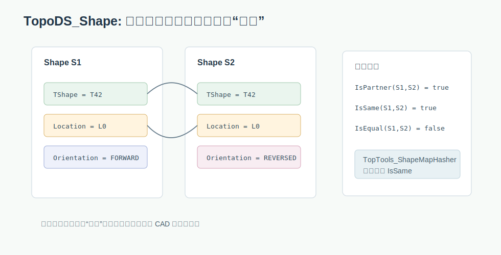

# 03. TopoDS_Shape 的身份：什么时候算同一个 shape

OCCT 数据结构最容易踩坑的地方，不是哈希表怎么实现，而是 key 的相等性是什么。`TopoDS_Shape` 不是一个厚重实体对象，它更像一个轻量句柄，内部指向共享的 `TShape`，再叠加 Location 和 Orientation。



关键文件：

```text
src/ModelingData/TKBRep/TopoDS/TopoDS_Shape.hxx
src/ModelingData/TKBRep/TopTools/TopTools_ShapeMapHasher.hxx
```

## Shape 的三个核心字段

`TopoDS_Shape` 里最重要的是：

```cpp
occ::handle(TopoDS_TShape) myTShape;
TopLoc_Location            myLocation;
TopAbs_Orientation         myOrient;
```

可以这样理解：

- `myTShape`：真正共享的拓扑数据。
- `myLocation`：这个 shape 在空间中的位置变换。
- `myOrient`：拓扑方向，例如 `TopAbs_FORWARD`、`TopAbs_REVERSED`。

因此同一个底层拓扑可以以不同位置、不同方向出现。

## IsPartner、IsSame、IsEqual

`TopoDS_Shape.hxx` 给了三层相等语义：

```text
IsPartner: TShape 相同，Location 和 Orientation 可以不同
IsSame:    TShape 相同，Location 相同，Orientation 可以不同
IsEqual:   TShape、Location、Orientation 都相同
```

这三个语义对应不同业务问题：

- 想知道是不是同一个底层拓扑实体：看 `IsPartner`。
- 想在空间位置上去重，但忽略方向：看 `IsSame`。
- 想连方向也严格区分：看 `IsEqual`。

## ShapeMapHasher 使用 IsSame

`TopTools_ShapeMapHasher` 的相等判断使用 `S1.IsSame(S2)`，哈希值委托给 `std::hash<TopoDS_Shape>`；后者组合了 `TShape` 指针和 `Location`。也就是说，OCCT 常用的 shape map 默认忽略 Orientation，但考虑 TShape 和 Location。

这非常关键。举个直觉例子：

```text
同一条边，在一个 wire 里可能是 FORWARD，在另一个语境里可能是 REVERSED。
如果用 ShapeMapHasher，它们在 map 里会被视为同一个 key。
```

这正是很多拓扑统计想要的效果：同一几何/拓扑位置的边只算一次，不因为方向出现两次。

## 实例：一条边在两个面中方向相反

想象两个面共享一条边：

```text
Face A 使用 Edge e，方向 FORWARD
Face B 使用 Edge e，方向 REVERSED
```

如果你要统计模型有多少条独立 edge，应该把它们算作一条。这时 `TopTools_ShapeMapHasher` 很合适，因为它用 `IsSame`，忽略 orientation。

但如果你在分析 wire 的方向、边界环顺序、法向一致性，就不能只依赖 map 的 key 去重。你需要在取出 shape 后继续看：

```cpp
if (anEdge.Orientation() == TopAbs_REVERSED)
{
  // 起点和终点语义要反过来
}
```

这就是 OCCT 拓扑代码常见的双层判断：

```text
身份去重：IsSame
方向逻辑：Orientation
```

## Orientation 仍然重要

忽略方向不等于方向没用。`TopExp.cxx` 里有大量根据 `Orientation()` 判断起点、终点、边方向的逻辑。例如处理 wire 顶点时，需要看边是 forward 还是 reversed。

这形成了一个常见模式：

```text
哈希表去重时：用 IsSame，忽略 Orientation
具体拓扑算法时：读取 Orientation，决定方向相关行为
```

如果你自己写 OCCT 算法，这是很重要的经验法则。

## useOrientation 参数

`TopExp::MapShapesAndUniqueAncestors` 有一个 `useOrientation` 参数。源码里可以看到它在判断 ancestor 是否已经加入列表时，会在两种语义之间切换：

```text
useOrientation == false: 用 IsSame 去重
useOrientation == true:  用 IsEqual 去重
```

这说明 OCCT 并不是永远忽略方向，而是把方向作为可选业务语义交给调用者。

## 自定义语义时要谨慎

如果你写自己的 hasher，必须保证：

```text
Equal(a, b) == true  =>  Hash(a) == Hash(b)
```

OCCT 的 `TopTools_ShapeMapHasher` 做到这一点，是因为 hash 组合了 `TShape` 和 `Location`，而 equality 也正好比较这两部分。

不要写出这种危险组合：

```text
hash 考虑 Orientation
equal 忽略 Orientation
```

这会让哈希表在不同桶里放入“相等”的对象，导致查找和去重行为不可预测。

## 普通哈希表课程里的对应知识

在普通数据结构课里，我们会说哈希表需要：

1. 哈希函数。
2. 相等函数。
3. 二者一致：相等对象必须有相同 hash。

OCCT 里这个原则仍然成立，只是 key 变成了 `TopoDS_Shape`。问题也变得更工程化：

```text
你的算法到底希望“方向不同”算同一个，还是不同？
```

选错相等语义，程序不一定崩，但结果会悄悄错。

## 阅读检查

读任何 `NCollection_*<TopoDS_Shape, TopTools_ShapeMapHasher>` 时，都问自己：

- 这里忽略 Orientation 是否合理？
- Location 是否应该参与身份判断？
- 如果同一个 edge 以两个方向出现，算法想保留一份还是两份？
- 如果 value 是列表，列表里是否还需要用 `IsSame` 或 `IsEqual` 做二次去重？

把这几个问题问清楚，OCCT 拓扑代码会突然变得有秩序。
