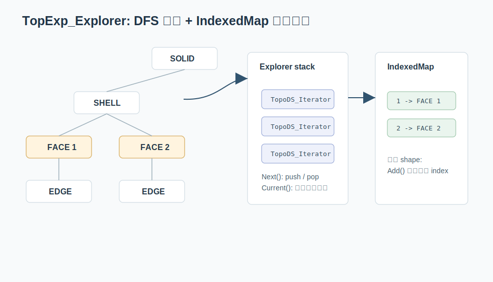

# 04. TopExp_Explorer：把拓扑结构当成树来遍历

OCCT 的拓扑对象有层级关系：

```text
COMPOUND
  SOLID
    SHELL
      FACE
        WIRE
          EDGE
            VERTEX
```

真实模型不一定这么规整，但这个层级足以说明问题。`TopExp_Explorer` 就是 OCCT 里遍历这个拓扑结构的经典工具。



关键文件：

```text
src/ModelingData/TKBRep/TopExp/TopExp_Explorer.hxx
src/ModelingData/TKBRep/TopExp/TopExp_Explorer.cxx
src/ModelingData/TKBRep/TopExp/TopExp.cxx
```

## 基本用法

典型代码：

```cpp
TopExp_Explorer ex(aShape, TopAbs_FACE);
for (; ex.More(); ex.Next())
{
  const TopoDS_Shape& aFace = ex.Current();
}
```

在 OCCT 8.0 的头文件中，`TopExp_Explorer` 还提供了 range-for 支持，但仍保留传统 `More()/Next()/Current()` 风格。

## Explorer 内部是遍历栈

`TopExp_Explorer.cxx` 内部维护一组 `TopoDS_Iterator`，可以把它看成 DFS 栈：

```text
stack[0] -> 当前 shape 的子迭代器
stack[1] -> 某个子 shape 的子迭代器
stack[2] -> 更深层的子迭代器
```

每次 `Next()` 会：

1. 尝试推进当前层。
2. 如果当前子形状还能继续向下，就 push 新的 iterator。
3. 如果当前层遍历完，就 pop 回上一层。
4. 找到目标类型时，把它作为 `Current()` 暴露出来。

这就是普通数据结构课里的深度优先遍历，只不过节点是 `TopoDS_Shape`。

## ToAvoid 参数

`TopExp_Explorer` 可以指定目标类型 `ToFind` 和避开类型 `ToAvoid`。例如：

```cpp
TopExp_Explorer ex(aShape, TopAbs_VERTEX, TopAbs_EDGE);
```

这类调用表达的是：

```text
找 vertex，但不要深入 edge 下面。
```

这个参数让遍历不只是“全树 DFS”，而是带剪枝的 DFS。

## 场景：只找 shell 直属的 face

如果你从一个 compound 开始找 face，默认可能会深入 solid、shell、wire 等层级。某些算法只想看某一层的结构，不想继续深入某类 shape。`ToAvoid` 就像 DFS 的剪枝条件。

可以把它理解成：

```text
遇到 ToAvoid 类型的节点时，不再展开它的孩子。
```

这和树搜索里的 pruning 一样。区别只是这里的节点类型是 `TopAbs_ShapeEnum`。

## TopExp::MapShapes

`TopExp::MapShapes` 是对 explorer 的常用封装：

```cpp
NCollection_IndexedMap<TopoDS_Shape, TopTools_ShapeMapHasher> aFaceMap;
TopExp::MapShapes(aShape, TopAbs_FACE, aFaceMap);
```

源码逻辑非常直接：

```text
创建 TopExp_Explorer
while More:
    M.Add(Current)
    Next
```

关键在 `M` 是 `IndexedMap`，所以每个 face 不只是被去重，还被赋予一个稳定编号：

```text
face -> 1
face -> 2
face -> 3
...
```

这会成为很多后续数组算法的入口。

## 实例：给所有面分配材料编号

假设你要给一个 solid 的所有 face 生成一个材料表：

```cpp
NCollection_IndexedMap<TopoDS_Shape, TopTools_ShapeMapHasher> aFaces;
TopExp::MapShapes(aSolid, TopAbs_FACE, aFaces);

NCollection_Array1<int> aMaterialIds(1, aFaces.Extent());
for (int i = 1; i <= aFaces.Extent(); ++i)
{
  const TopoDS_Shape& aFace = aFaces.FindKey(i);
  aMaterialIds.SetValue(i, ComputeMaterialId(aFace));
}
```

这个例子体现了 `TopExp + IndexedMap + Array1` 的三段式：

```text
遍历拓扑 -> 去重编号 -> 数组保存算法结果
```

## 遍历和去重是两件事

`TopExp_Explorer` 会按拓扑结构遍历，可能遇到重复引用。`NCollection_IndexedMap` 才负责去重。

所以 `MapShapes` 的组合意义是：

```text
Explorer: 负责“找到所有候选”
IndexedMap: 负责“去重并编号”
```

这在复杂模型里非常重要。同一个 edge 可能被多个 face 引用，遍历 face 的时候自然会多次遇到它，但建边集合时通常只希望保留一次。

## 测试文件提供了很好的入口

`src/ModelingData/TKBRep/GTests/TopExp_Test.cxx` 展示了 OCCT 8.0 里推荐的类型写法：

```cpp
NCollection_IndexedMap<TopoDS_Shape, TopTools_ShapeMapHasher> aFaceMap;
NCollection_IndexedMap<TopoDS_Shape, TopTools_ShapeMapHasher> anEdgeMap;
NCollection_IndexedMap<TopoDS_Shape, TopTools_ShapeMapHasher> aVertexMap;
```

如果想写自己的小实验，可以从这个测试文件抄类型和 include，再换成自己的 shape。

## 本章小结

`TopExp_Explorer` 是 DFS；`TopExp::MapShapes` 是 DFS + 去重 + 编号。只要抓住这个组合，很多拓扑 API 的行为就不再神秘。
