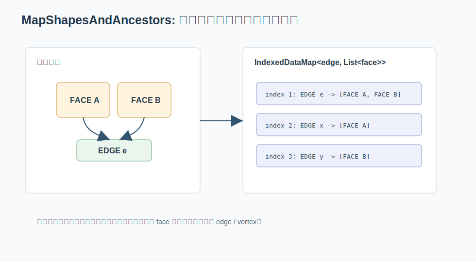

# 05. MapShapesAndAncestors：CAD 拓扑里的反向索引

如果 `MapShapes` 是“收集所有 face/edge/vertex”，那 `MapShapesAndAncestors` 就是“建立子形状到父形状的反向索引”。



关键文件：

```text
src/ModelingData/TKBRep/TopExp/TopExp.hxx
src/ModelingData/TKBRep/TopExp/TopExp.cxx
```

## 问题：从 edge 找相邻 face

CAD 拓扑里经常需要回答：

```text
这条 edge 属于哪些 face？
这个 vertex 连接哪些 edge？
这个 edge 被哪些 wire 使用？
```

如果每次都从根 shape 重新遍历，成本会很高。因此我们会先建索引。

## 数据结构

`TopExp::MapShapesAndAncestors` 使用：

```cpp
NCollection_IndexedDataMap<
    TopoDS_Shape,
    NCollection_List<TopoDS_Shape>,
    TopTools_ShapeMapHasher>
```

翻译成人话：

```text
子形状 -> 包含它的祖先形状列表
```

例如：

```text
edge E1 -> [face F1, face F2]
edge E2 -> [face F2]
vertex V1 -> [edge E1, edge E3, edge E8]
```

这就是邻接表。

## 源码思路

`TopExp.cxx` 里的核心逻辑可以概括为：

```text
遍历所有 ancestor 类型的 shape
    对每个 ancestor，遍历它内部所有 sub-shape
        在 IndexedDataMap 中查 sub-shape 的 index
        如果没有，就 Add(sub-shape, empty-list)
        把 ancestor 追加到该 sub-shape 的 list
```

注意这里用了 `IndexedDataMap`，所以它既能：

- 快速从 sub-shape 查到列表。
- 按稳定 index 遍历所有 sub-shape。

## UniqueAncestors

`MapShapesAndUniqueAncestors` 比 `MapShapesAndAncestors` 多一步：同一个 ancestor 不重复加入列表。

源码里会遍历当前列表，按 `useOrientation` 决定用 `IsSame` 还是 `IsEqual` 判断重复：

```text
useOrientation = false -> 同 TShape + Location 即视为重复
useOrientation = true  -> TShape + Location + Orientation 都相同才重复
```

这正好回到第 3 章：数据结构里的“相等”永远是业务语义的一部分。

## 典型调用

如果你要找每条边相邻的面：

```cpp
NCollection_IndexedDataMap<
    TopoDS_Shape,
    NCollection_List<TopoDS_Shape>,
    TopTools_ShapeMapHasher> edgeToFaces;

TopExp::MapShapesAndAncestors(
    aShape,
    TopAbs_EDGE,
    TopAbs_FACE,
    edgeToFaces);
```

之后：

```cpp
for (int i = 1; i <= edgeToFaces.Extent(); ++i)
{
  const TopoDS_Shape& edge = edgeToFaces.FindKey(i);
  const NCollection_List<TopoDS_Shape>& faces = edgeToFaces(i);
}
```

这里的 `i` 就是稳定编号。你可以拿它作为数组下标，把边长度、状态、可见性、相邻面数量等信息放进独立数组。

## 实例：判断边界边和非流形边

建好 `edgeToFaces` 后，列表长度很有意义：

```text
faces count == 1  -> 边界边
faces count == 2  -> 普通流形共享边
faces count >  2  -> 非流形边
```

伪代码：

```cpp
for (int i = 1; i <= edgeToFaces.Extent(); ++i)
{
  const TopoDS_Shape& anEdge = edgeToFaces.FindKey(i);
  const NCollection_List<TopoDS_Shape>& aFaces = edgeToFaces(i);

  if (aFaces.Extent() == 1)
  {
    MarkBoundaryEdge(anEdge);
  }
  else if (aFaces.Extent() > 2)
  {
    ReportNonManifoldEdge(anEdge, aFaces.Extent());
  }
}
```

这就是非常真实的 CAD 数据质量检查。

## 实例：从 vertex 找相邻 edge

同一个 API 换一组类型参数，就能变成顶点邻接表：

```cpp
NCollection_IndexedDataMap<
    TopoDS_Shape,
    NCollection_List<TopoDS_Shape>,
    TopTools_ShapeMapHasher> vertexToEdges;

TopExp::MapShapesAndAncestors(
    aShape,
    TopAbs_VERTEX,
    TopAbs_EDGE,
    vertexToEdges);
```

普通图算法里这就是：

```text
vertex -> incident edges
```

有了它，你可以做连通性分析、端点识别、孤立边检查。

## 和图算法的关系

如果把 topology 看成图：

- vertex、edge、face 都可以是节点。
- “属于”“相邻”“包含”都是边。
- `MapShapesAndAncestors` 建的就是从子节点到父节点的邻接表。

它和普通图课里的邻接表没有本质区别，只是节点类型更复杂，去重语义更讲究。

## 常见用途

这个模式常用于：

- 判断 edge 是边界边还是共享边。
- 从 vertex 找相邻 edge，做连通性分析。
- 从 edge 找 face，判断流形/非流形结构。
- 在布尔运算或修复算法中传播修改关系。
- 在显示、网格、特征识别中快速反查拓扑上下文。

## 本章小结

`MapShapesAndAncestors` 是 OCCT 中最漂亮的数据结构应用之一：DFS 遍历、哈希去重、稳定编号、链表邻接表全部揉在一个 API 里。它也最能说明，学数据结构最终是为了把对象关系组织得可查询、可更新、可解释。
