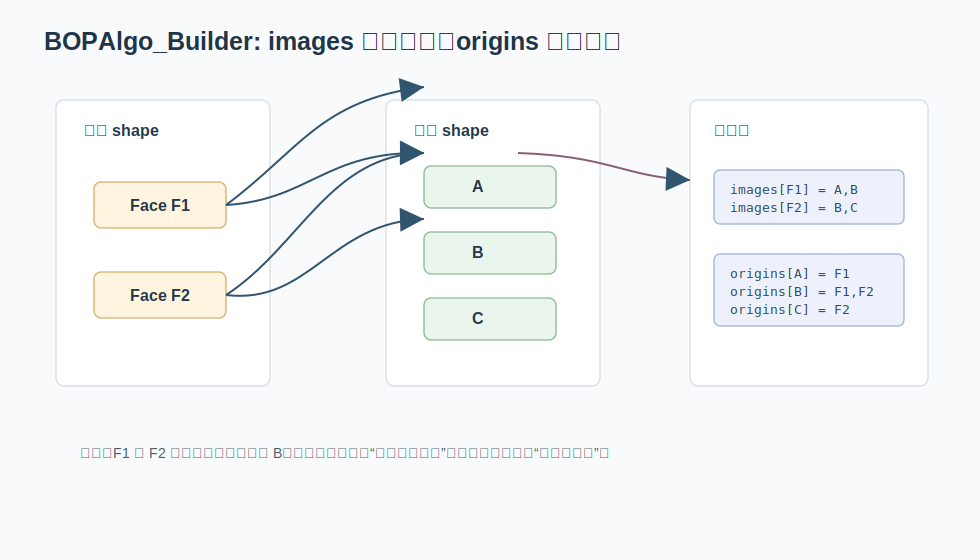

# 06. BOPAlgo_Builder：布尔运算里的 images 和 origins

布尔运算是 CAD 内核里最复杂的模块之一。两个实体相交、切分、合并之后，原来的 face/edge/vertex 可能被删除、保留、切成多段或生成新拓扑。`BOPAlgo_Builder` 的数据结构任务，就是维护这些变化关系。



关键文件：

```text
src/ModelingAlgorithms/TKBO/BOPAlgo/BOPAlgo_Builder.hxx
src/ModelingAlgorithms/TKBO/BOPAlgo/BOPAlgo_Builder_1.cxx
src/ModelingAlgorithms/TKBO/BOPAlgo/BOPAlgo_Builder_2.cxx
src/ModelingAlgorithms/TKBO/BOPAlgo/BOPAlgo_Builder_3.cxx
src/ModelingAlgorithms/TKBO/BOPAlgo/BOPAlgo_PaveFiller.hxx
```

## Builder 的核心容器

`BOPAlgo_Builder.hxx` 里有几组非常典型的成员：

```cpp
NCollection_List<TopoDS_Shape> myArguments;

NCollection_Map<TopoDS_Shape, TopTools_ShapeMapHasher> myMapFence;

NCollection_DataMap<
    TopoDS_Shape,
    NCollection_List<TopoDS_Shape>,
    TopTools_ShapeMapHasher> myImages;

NCollection_DataMap<
    TopoDS_Shape,
    TopoDS_Shape,
    TopTools_ShapeMapHasher> myShapesSD;

NCollection_DataMap<
    TopoDS_Shape,
    NCollection_List<TopoDS_Shape>,
    TopTools_ShapeMapHasher> myOrigins;
```

把类型名翻译掉，它们分别是：

```text
myArguments : 输入 shape 列表
myMapFence  : 输入/中间 shape 去重集合
myImages    : 原 shape -> 结果 shape 列表
myShapesSD  : shape -> same-domain 代表 shape
myOrigins   : 结果 shape -> 来源 shape 列表
```

这已经像一个小型关系数据库。

## images：从原对象到结果对象

布尔运算中，一个原始 edge 可能：

- 完全保留。
- 被交点切成多条 edge。
- 被替换为 same-domain edge。
- 消失。

所以 value 不能是单个 shape，而必须是 `NCollection_List<TopoDS_Shape>`：

```text
edge E -> [E1, E2, E3]
face F -> [F1, F2]
```

`BOPAlgo_Builder_1.cxx` 中可以看到 `myImages.Bound(...)->Append(...)` 这种模式：

```text
如果 key 不存在，就绑定一个空列表
然后向列表追加 image
```

这正是 `DataMap<Key, List<Value>>` 的经典用法。

## 小案例：一条边被两个交点切开

假设原始边 `E` 被两个交点切成三段：

```text
E -> E1, E2, E3
```

`myImages` 会表达为：

```text
myImages[E] = [E1, E2, E3]
```

如果算法后续问 `Modified(E)`，就可以直接返回这条列表。这里 value 用链表是合理的，因为结果数量不固定，追加很频繁。

## origins：反向关系

`myOrigins` 是反向索引：

```text
结果 shape -> 它来自哪些原 shape
```

为什么要反向？因为后处理阶段常常拿到一个结果 shape，然后需要回答：

```text
它是由哪个输入 face/edge 产生的？
```

这对建模历史、属性传播、错误报告、选择高亮都很重要。

## 小案例：一个结果面来自两个输入面

布尔运算中，结果面 `R` 可能来自输入面 `F1` 和 `F2` 的重合区域：

```text
myOrigins[R] = [F1, F2]
```

如果用户选中了结果面 `R`，建模软件可能需要高亮原始参与面，或者把 `F1` 的颜色、名称、属性传播到 `R`。这时只看 `myImages` 不方便，`myOrigins` 就是反查索引。

## ShapesSD：same-domain 归并

`myShapesSD` 是：

```text
shape -> same-domain 代表 shape
```

same-domain 可以粗略理解为“几何上应被视为同域的一组拓扑对象”。算法会选择一个代表，把多个等价或重合对象归并到它。

这和并查集思想很接近，虽然这里不一定直接用 union-find 实现。它解决的是“多个输入对象在运算后应合并成一个语义对象”的问题。

可以把 `myShapesSD` 看成一种“代表元表”：

```text
Face A -> Face R
Face B -> Face R
Face C -> Face C
```

这表示 A、B 被归并到 R，而 C 保持自己。后续算法只要查一次代表元，就能避免重复构造同域拓扑。

## Fence：避免重复

`myMapFence` 或局部变量 `aMFence` 经常出现。它们通常没有复杂 value，只用于：

```text
这个 shape 我是否已经加入某个列表？
```

大型几何算法里，重复加入不仅浪费时间，还可能造成后续拓扑构造错误。所以 fence map 是非常实用的防重复结构。

## PaveFiller 的容器密度

`BOPAlgo_PaveFiller.hxx` 里还能看到更多组合：

```cpp
NCollection_DataMap<int, NCollection_List<int>>
NCollection_Map<int>
NCollection_IndexedMap<occ::handle<BOPDS_PaveBlock>>
NCollection_IndexedDataMap<TopoDS_Shape, BOPDS_CoupleOfPaveBlocks, TopTools_ShapeMapHasher>
```

这里已经从 shape 层下降到算法内部编号层。整数 map/list 常常代表：

- 顶点编号集合。
- 边编号集合。
- face 内部需要处理的子对象。
- pave block 之间的关系。

这说明 OCCT 并不是只用“对象做 key”。当算法进入高频计算区，它会积极使用整数编号来降低访问成本。

## Debug 时应该盯哪些表

如果布尔结果不符合预期，数据结构层面的排查顺序通常是：

1. `myArguments`：输入是否真的加入。
2. `myMapFence`：是否被错误去重。
3. `myImages`：原 shape 有没有生成预期结果。
4. `myOrigins`：结果 shape 的来源是否完整。
5. `myShapesSD`：same-domain 代表是否把不该合并的对象合并了。

这比一头扎进几何求交公式更容易定位问题。

## 数据结构视角的布尔运算流程

粗略说：

```text
输入 arguments
  -> PaveFiller 计算交点、切分信息、内部编号关系
  -> Builder 填充 vertices/edges/faces 的 images
  -> same-domain 合并与 origins 回填
  -> 构造结果 shape
  -> 对外提供 Modified/Generated/IsDeleted 查询
```

这条链路里，数据结构不是辅助品，而是算法状态本身。

## 本章小结

`BOPAlgo_Builder` 是“哈希表 + 链表 + 去重集合 + 反向索引”的大型应用。读它时不要先陷入几何细节，先把每个 map 的 key/value 语义翻译出来。只要能说清楚 `myImages`、`myOrigins`、`myShapesSD`，布尔运算源码的大轮廓就已经站住了。
