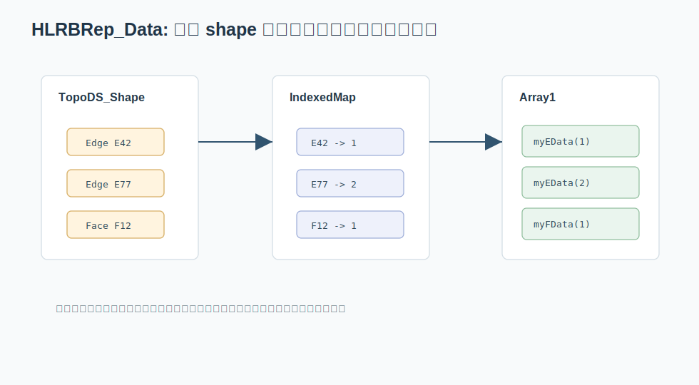

# 07. HLRBRep_Data：IndexedMap + Array1 的编号压缩模式

HLR 是 Hidden Line Removal，隐线消除。它需要处理大量边、面和它们之间的遮挡关系。这里的核心数据结构模式是：

```text
复杂 shape -> 稳定整数编号 -> 数组中的计算数据
```



关键文件：

```text
src/ModelingAlgorithms/TKHLR/HLRBRep/HLRBRep_Data.hxx
src/ModelingAlgorithms/TKHLR/HLRBRep/HLRBRep_Data.cxx
src/ModelingAlgorithms/TKHLR/HLRBRep/HLRBRep_ShapeBounds.hxx
```

## 成员结构

`HLRBRep_Data.hxx` 里有这些成员：

```cpp
NCollection_IndexedMap<TopoDS_Shape, TopTools_ShapeMapHasher> myEMap;
NCollection_IndexedMap<TopoDS_Shape, TopTools_ShapeMapHasher> myFMap;

NCollection_Array1<HLRBRep_EdgeData> myEData;
NCollection_Array1<HLRBRep_FaceData> myFData;
NCollection_Array1<int>              myEdgeIndices;
```

翻译一下：

```text
myEMap       : edge shape -> edge index
myFMap       : face shape -> face index
myEData      : edge index -> edge algorithm data
myFData      : face index -> face algorithm data
myEdgeIndices: 辅助整数数组
```

这是非常经典的编号压缩。

## 为什么不用 map 直接存 EdgeData

当然可以写成：

```text
DataMap<TopoDS_Shape, HLRBRep_EdgeData>
```

但 HLR 算法会密集访问边/面数据。用 `IndexedMap + Array1` 有几个好处：

- 编号是整数，循环更简单。
- 数组访问局部性更好。
- 可以把算法状态拆到多个并行数组。
- 后续几何计算函数只传 `int edgeIndex`，接口更轻。
- 某些历史算法天然按 1-based index 组织。

这就是从“对象友好”到“计算友好”的转换。

## 实例：边可见性数组

隐线算法经常需要反复更新一条边的状态：

```text
可见
被某个面遮挡
部分可见
和另一条边相交
```

如果每次都用 shape 做 key 查哈希表，计算路径会变长。使用编号后，可以写成：

```cpp
int anEdgeId = myEMap.FindIndex(anEdge);
HLRBRep_EdgeData& anEdgeData = myEData.ChangeValue(anEdgeId);
anEdgeData.HideCount(aNewCount);
```

这类代码说明：哈希表只在“对象进入算法世界”的入口使用，进入以后尽量用数组。

## Array1 的特点

`NCollection_Array1<T>` 不是普通 `std::vector<T>`。它有下界和上界，例如：

```cpp
NCollection_Array1<HLRBRep_EdgeData> myEData(0, NE);
```

这意味着合法下标可以是 `0..NE`，也可以由调用者设成 `1..N`。OCCT 老代码里这种数组很常见。

读 `Array1` 代码时要特别注意：

- `Lower()`。
- `Upper()`。
- `Length()`。
- `Value(index)` / `ChangeValue(index)`。
- `operator()(index)`。

不要假设所有数组都从 0 开始。

## 访问模式

在 `HLRBRep_Data.cxx` 里经常出现：

```cpp
HLRBRep_EdgeData& ed = myEData.ChangeValue(edge);
HLRBRep_FaceData& fd = myFData.ChangeValue(face);
```

这里的 `edge`、`face` 已经是整数编号。算法不再关心原始 `TopoDS_Shape` 的哈希细节，而是直接对紧凑数据做状态更新。

## 和图算法的类比

普通图算法里，我们经常先把字符串城市名映射成整数：

```text
"Shanghai" -> 0
"Beijing"  -> 1
```

然后用数组保存距离、访问状态、前驱节点：

```text
dist[cityId]
visited[cityId]
prev[cityId]
```

HLR 的做法完全一样：

```text
TopoDS_Edge -> edgeId -> myEData[edgeId]
TopoDS_Face -> faceId -> myFData[faceId]
```

只是“城市名”换成了 CAD 拓扑对象。

## 实例：并行数组思维

很多算法会把不同状态拆成多个数组：

```text
edge id -> geometry data
edge id -> visibility state
edge id -> min/max range
edge id -> temporary mark
```

OCCT 代码中这些状态未必都叫数组，有些封装在 `HLRBRep_EdgeData` 里。但设计思想一样：编号让这些状态可以对齐。

```text
myEData(17)
myEdgeIndices(17)
otherState(17)
```

只要 index 一致，它们就描述同一条 edge。

## ShapeBounds：分组和范围

`HLRBRep_ShapeBounds` 这类结构保存的是某个 shape 相关的边界、范围、数量等信息。它和 `HLRBRep_Data` 配合，把“模型中有哪些 shape”和“每个 shape 的数据范围”拆开。

这也是大型算法常见设计：

```text
全局数组存数据
小对象存范围/索引
通过 index 连接二者
```

## 本章小结

`IndexedMap + Array1` 是 OCCT 里非常重要的模式。它把复杂对象世界压缩成整数世界，让后续算法可以像处理数组一样处理拓扑数据。理解这个模式后，再看网格、显示、隐线、布尔运算中的编号表都会顺眼很多。
