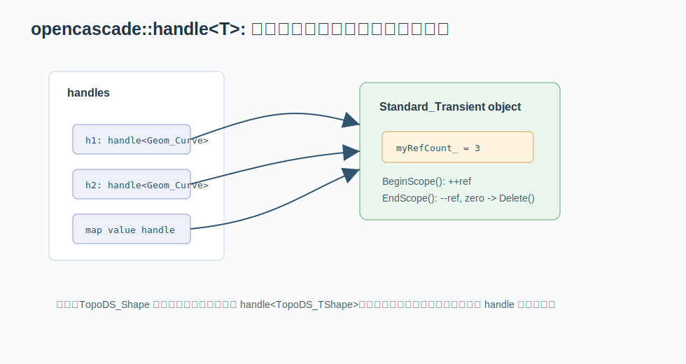

# 08. Handle 和 Standard_Transient：对象图的生命周期

数据结构不只关心“数据放在哪里”，也关心“数据什么时候释放”。OCCT 的对象图很大，几何曲线、曲面、类型描述、交互对象、算法状态都可能互相引用。OCCT 使用 `opencascade::handle<T>` 管理继承自 `Standard_Transient` 的对象。



关键文件：

```text
src/FoundationClasses/TKernel/Standard/Standard_Handle.hxx
src/FoundationClasses/TKernel/Standard/Standard_Transient.hxx
src/FoundationClasses/TKernel/Standard/Standard_Transient.cxx
src/FoundationClasses/TKernel/Standard/Standard_Type.hxx
```

## 它是侵入式智能指针

`Standard_Handle.hxx` 里明确说明：`handle<T>` 是给 `Standard_Transient` 及其派生类使用的 intrusive smart pointer。

“侵入式”的意思是：

```text
引用计数存在被管理对象内部，而不是像 shared_ptr 那样存在独立 control block 里。
```

`Standard_Transient` 内部有原子引用计数，并提供：

```cpp
GetRefCount()
IncrementRefCounter()
DecrementRefCounter()
```

`handle<T>` 赋值、拷贝、析构时会增减这个计数。OCCT 8.0 的实现里，递增使用 relaxed 原子操作；递减使用 release，并在计数降到 0 时加 acquire fence 后删除对象。

## 为什么 OCCT 采用这种方式

OCCT 历史很长，句柄体系早于现代 C++ 普及。侵入式计数有一些适合它的地方：

- 对象基类统一，便于 RTTI 和句柄转换。
- 不需要额外 control block。
- API 中大量使用 `Handle(Class)` 宏和 `occ::handle<T>`。
- 和 OCCT 自己的异常、类型系统、动态类型检查保持一致。

代价是：

- 只有继承自 `Standard_Transient` 的对象才能被 handle 管。
- 对象生命周期和基类强绑定。
- 仍然需要避免循环引用。

## handle 不是 TopoDS_Shape

一个容易混淆的点：`TopoDS_Shape` 本身通常不是 `handle<TopoDS_Shape>`，它是一个值类型轻量对象，内部持有 `occ::handle<TopoDS_TShape>`。

所以你常看到：

```text
TopoDS_Shape                // 值对象，复制便宜，内部共享 TShape
occ::handle(Geom_Curve)     // 句柄对象，引用计数管理
occ::handle(AIS_InteractiveObject)
```

这解释了为什么 OCCT 里既有值语义的 shape，又有 handle 语义的几何/显示对象。

## RTTI 和 DownCast

`Standard_Type.hxx`、`Standard_Transient.cxx` 支持 OCCT 自己的 RTTI。`handle<T>` 提供 `DownCast`，用于从基类句柄转派生类句柄。

普通 C++ 里你可能写：

```cpp
std::shared_ptr<Base> p;
auto d = std::dynamic_pointer_cast<Derived>(p);
```

OCCT 里常见的是：

```cpp
Handle(Derived) d = Handle(Derived)::DownCast(p);
```

或者使用新版风格：

```cpp
occ::handle<Derived> d = occ::down_cast<Derived>(p);
```

## 容器里的 handle

OCCT 容器经常保存 handle，例如：

```cpp
NCollection_List<occ::handle<Message_Alert>>
NCollection_IndexedMap<occ::handle<BOPDS_PaveBlock>>
NCollection_DataMap<
    occ::handle<AIS_InteractiveObject>,
    occ::handle<AIS_GlobalStatus>>
```

这时容器节点里保存的是句柄，复制容器元素会增减引用计数。理解这一点有助于判断：

- 容器清空是否会释放对象。
- 对象是否还被其他结构持有。
- value 是共享状态还是独占状态。

## 实例：DataMap 保存交互对象状态

在交互显示系统里，一个对象可能处于 displayed、erased、selected、highlighted 等状态。`AIS_InteractiveContext` 用：

```cpp
NCollection_DataMap<
    occ::handle<AIS_InteractiveObject>,
    occ::handle<AIS_GlobalStatus>> myObjects;
```

这张表的 key 和 value 都是 handle。含义是：

```text
交互对象 -> 它在当前 context 中的全局显示状态
```

当对象被加入 map 时，key handle 会增加引用计数；当对象从 map 移除、且没有其他 handle 持有时，对象才会释放。

## 实例：为什么不要随便取裸指针长期保存

`handle<T>` 可以通过 `operator->` 使用对象，因此很多时候看起来像裸指针。但如果你把裸指针取出来长期保存：

```cpp
AIS_InteractiveObject* pObj = aHandle.get();
```

然后所有 handle 都释放了，`pObj` 就悬空。OCCT 代码里如果需要跨作用域保存对象，应该保存 `occ::handle<T>`，而不是裸指针。

## AIS_InteractiveContext 例子

`src/Visualization/TKV3d/AIS/AIS_InteractiveContext.hxx` 里有：

```cpp
NCollection_DataMap<
    occ::handle<AIS_InteractiveObject>,
    occ::handle<AIS_GlobalStatus>> myObjects;

NCollection_Sequence<int> myDetectedSeq;
occ::handle<AIS_Selection> mySelection;
```

这说明可视化交互层也在使用同样的数据结构组合：

- 用 `DataMap` 从交互对象查全局状态。
- 用 `Sequence<int>` 保存检测/选择顺序。
- 用 handle 管理可共享对象生命周期。

## 本章小结

OCCT 的数据结构世界分成两层：

```text
值对象层：TopoDS_Shape、gp_Pnt、整数编号、数组数据
句柄对象层：Geom_*、AIS_*、Message_*、Standard_Type 等引用计数对象
```

读源码时先判断一个类型是值对象还是 handle 对象。它决定了复制成本、生命周期、相等语义和容器行为。
